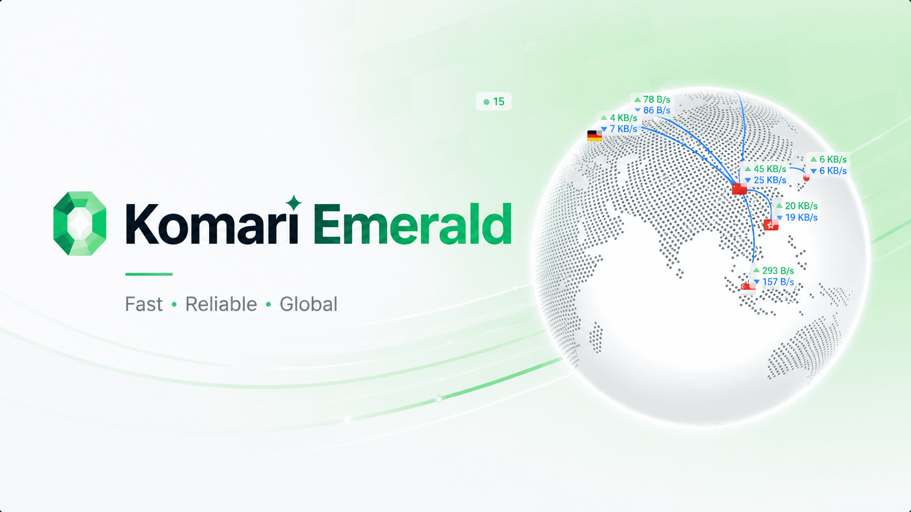

<h3 align="center"> Monitor Theme Emerald </h3>
<p align="center">
基于 Vue 3 + Tailwind CSS v4 + reka-ui 构建的 <a href="https://github.com/monitor-probe/monitor">monitor</a> 状态面板主题
</p>

<p align="center">
移植自 <a href="https://github.com/Tokinx/komari-theme-emerald">Tokinx/komari-theme-emerald</a>，适配 monitor-probe 契约规范。
</p>



## 特性

- 🌐 **3D 交互地球 / 点状世界地图**：基于 Cobe 与 ECharts，自动通过国家代码映射节点位置。
- ⚡ **实时状态推送**：全面接入 monitor-probe WebSocket (`/api/ws`)，2 秒实时动态刷新。
- 📊 **历史指标与探针图表**：支持 CPU、内存、网络、硬盘与多探针延迟曲线及丢包率展示。
- 🎨 **主题配置表单集成**：支持在 monitor-probe 面板的主题设置页可视化调节头部展示模式、自定义背景、公告等。
- 📱 **完美响应式**：卡片与列表视图任意切换，移动端适配良好。

## 安装方法

### 方式一：面板上传安装

1. 从 [Releases 页面](https://github.com/binaryu/monitor-theme-emerald/releases) 下载最新的 `theme.tar.gz` 文件。
2. 登录 monitor-probe 后台（`/admin`），进入「主题」页。
3. 点击「上传主题」，选择 `theme.tar.gz` 完成安装并切换。

### 方式二：服务器目录放置

将 `theme.tar.gz` 解压至 monitor-hub 的 `--themes` 目录（默认一键部署路径为 `/opt/monitor/data/themes/`）：

```bash
mkdir -p /opt/monitor/data/themes/emerald
tar -xzf theme.tar.gz -C /opt/monitor/data/themes/
# 解压后目录结构为 /opt/monitor/data/themes/emerald/
```

然后在管理后台刷新「主题」页面并选用 Emerald 即可。

## 本地开发

主题只读公开数据，开发服务器可以直接使用现成的 hub 作为数据源：

```bash
# 安装依赖
pnpm install

# 代理到你的 monitor 实例进行实时调试
MONITOR_HUB=https://hub.example.com pnpm dev
```

不设置 `MONITOR_HUB` 时，默认代理至本地 `http://127.0.0.1:9911`。

## 构建主题包

```bash
pnpm build
```

构建完成后会自动生成标准的 `theme.tar.gz` 主题包，目录结构符合 monitor-probe 官方规范：

```text
emerald/
├── theme.json
├── preview.png
└── dist/
    └── index.html ...
```

可以使用 `gzip -t theme.tar.gz` 检查完整性。

## 技术栈

| 类别 | 技术 |
| --- | --- |
| 框架 | Vue 3 |
| 构建工具 | Vite 7 |
| UI 组件 | reka-ui（shadcn-vue 风格） |
| 样式方案 | Tailwind CSS v4 + tw-animate-css |
| 状态管理 | Pinia 3 |
| 路由系统 | Vue Router 5 (`/node/:id`) |
| 图表渲染 | ECharts 6 + vue-echarts |
| 3D 渲染 | Cobe (WebGL Globe) |

## 鸣谢

- 核心设计与原始实现：[Tokinx/komari-theme-emerald](https://github.com/Tokinx/komari-theme-emerald)
- 探针监控服务端与默认主题：[monitor-probe/monitor](https://github.com/monitor-probe/monitor) & [monitor-probe/monitor-theme-default](https://github.com/monitor-probe/monitor-theme-default)

## License

[MIT](./LICENSE)
